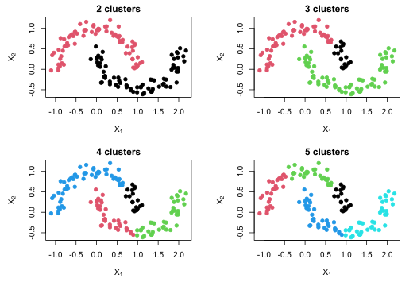
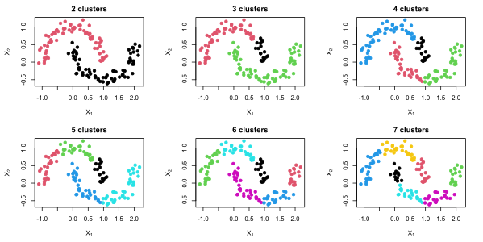
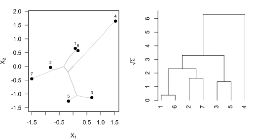
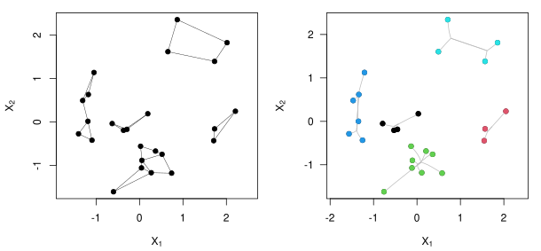

# CCMMR

[](https://www.gnu.org/licenses/gpl-3.0)
[](https://cran.r-project.org/package=CCMMR)
[](https://cran.r-project.org/package=CCMMR)

`CCMMR` implements convex clustering using the minimization algorithm presented in the paper _Convex Clustering through MM: An Efficient Algorithm to Perform Hierarchical Clustering_ by D.J.W. Touw, P.J.F. Groenen, and Y. Terada. For issues, please use [Github Issues](https://github.com/djwtouw/CCMMR/issues).

There is also a [Python package](https://github.com/djwtouw/CCMMPy) available.

## Contents
- [Installation](#installation)
- [Examples](#examples)
	* [Example 1: Computation of a clusterpath](#example-1-computation-of-a-clusterpath)
	* [Example 2: Searching for a number of clusters](#example-2-searching-for-a-number-of-clusters)
	* [Example 3: Alternative visualizations](#example-3-alternative-visualizations)
     * [Example 4: Different weight matrices](#example-4-different-weight-matrices)

## Installation
### From CRAN
`CCMMR` is available as a package on CRAN, hence the latest release can be installed using `R` via
```R
install.packages("CCMMR")
```
### Building from source
CCMMR has the following dependencies:
- r2r
- RANN
- Rcpp
- RcppEigen

To install `CCMMR`, clone the repository, open `CCMMR.Rproj` in RStudio, and press install in the build panel. Another option is to use devtools to install the package from GitHub via
```R
library(devtools)
install_github("djwtouw/CCMMR")
```

## Examples
The following examples are also part of the documentation of the package. Start with loading the package.
```R
library(CCMMR)
```
### Example 1: Computation of a clusterpath
After loading the data, a sparse weight matrix is constructed based on the `k = 5` nearest neighbors. This means that nonzero weights are computed only for pairs of objects that are _k_ nearest neighbors of each other. By default, the weight matrix is constructed so that every object is (in)directly connected to all other object via nonzero weights. This ensures that the minimum number of clusters is one. To turn off this behavior, set `connected = FALSE`. 
```R
# Load data
data(two_half_moons)
data = as.matrix(two_half_moons)
X = data[, -3]
y = data[, 3]

# Get sparse weights in dictionary of keys format with k = 5 and phi = 8
W = sparse_weights(X, 5, 8.0)

# Set a sequence for lambda
lambdas = seq(0, 2400, 1)

# Compute clusterpath
res = convex_clusterpath(X, W, lambdas)

# Get cluster labels for two clusters
labels = clusters(res, 2)

# Plot the clusterpath with colors based on the cluster labels
plot(res, col = labels)
```


### Example 2: Searching for a number of clusters
In the previous example, the choice for $\lambda$ has determined what the number of clusters was going to be. However, it can be difficult to guess in advance what value for $\lambda$ corresponds to a particular number of clusters. The following code looks for clusterings in a specified range. If no upper bound is specified, just a single number of clusters (equal to `target_low`) is looked for.
```R
# Load data
data(two_half_moons)
data = as.matrix(two_half_moons)
X = data[, -3]
y = data[, 3]

# Get sparse weights in dictionary of keys format with k = 5 and phi = 8
W = sparse_weights(X, 5, 8.0)

# Perform convex clustering with a target number of clusters
res1 = convex_clustering(X, W, target_low = 2, target_high = 5)

# Plot the clustering for 2 to 5 clusters
par(mfrow=c(2, 2))
plot(X, col = clusters(res1, 2), main = "2 clusters", pch = 19, 
     xlab = expression(X[1]), ylab = expression(X[2]))
plot(X, col = clusters(res1, 3), main = "3 clusters", pch = 19, 
     xlab = expression(X[1]), ylab = expression(X[2]))
plot(X, col = clusters(res1, 4), main = "4 clusters", pch = 19, 
     xlab = expression(X[1]), ylab = expression(X[2]))
plot(X, col = clusters(res1, 5), main = "5 clusters", pch = 19, 
     xlab = expression(X[1]), ylab = expression(X[2]))
```


```R
# A more generalized approach to plotting the results of a range of clusters
res2 = convex_clustering(X, W, target_low = 2, target_high = 7)

# Plot the clusterings
k = length(res2$num_clusters)
par(mfrow=c(ceiling(k / ceiling(sqrt(k))), ceiling(sqrt(k))))

for (i in 1:k) {
    labels = clusters(res2, res2$num_clusters[k + 1 - i])
    c = length(unique(labels))

    plot(X, col = labels, main = paste(c, "clusters"), pch = 19, 
         xlab = expression(X[1]), ylab = expression(X[2]))
}
```


### Example 3: Alternative visualizations
As an alternative to the clusterpath, convex clustering results can also be visualized using a dendrogram. In the following example, convex clustering is applied to a small randomly generated data set, after which the `as.hclust()` function transforms the output into a `hclust` object. Consequently, the standard `plot()` can be used to plot a dendrogram. Note that `hclust` objects require the clusterpath to terminate in a single cluster.
```R
# Demonstration of converting a clusterpath into a dendrogram, first generate
# data
set.seed(6)
X = matrix(rnorm(14), ncol = 2)
y = rep(1, nrow(X))

# Get sparse weights in dictionary of keys format with k = 3
W = sparse_weights(X, 3, 4.0)

# Sequence for lambda
lambdas = seq(0, 45, 0.02)

# Compute results
res = convex_clusterpath(X, W, lambdas)

# Generate hclust object
hcl = as.hclust(res)
hcl$height = sqrt(hcl$height)

# Plot clusterpath (left) and dendrogram (right)
par(mfrow=c(1, 2))
plot(res, y, label = c(1:7))
plot(hcl, ylab = expression(sqrt(lambda)), xlab = NA, sub = NA, main = NA,
     hang = -1)
```


### Example 4: Different weight matrices
An important part of convex clustering is the choice for the weight matrix. In [Example 1](#example-1-computation-of-a-clusterpath), the option for a disconnected weight matrix was briefly mentioned, this example elaborates on the available options. The first option is to not enforce connectedness at all. 
```R
set.seed(6)
X = matrix(rnorm(50), ncol = 2)
y = rep(1, nrow(X))

# Get sparse weights in dictionary of keys format with k = 2, connectedness is
# not enforced
W = sparse_weights(X, k = 2, phi = 4.0, connected = FALSE)

# Create a scatter plot of the data
par(mfrow=c(1, 2))
plot(X, col = y, pch = 19, xlab = expression(X[1]), ylab = expression(X[2]),
     asp = 1)

# Add lines between the objects based on the nonzero weights between them
for (i in 1:nrow(W$keys)) {
    point1_idx = W$keys[i, 1]
    point2_idx = W$keys[i, 2]
    
    # Prevent edges from being drawn twice
    if (point1_idx < point2_idx) {
        segments(X[point1_idx, 1], X[point1_idx, 2], X[point2_idx, 1],
                 X[point2_idx, 2], col = "black", lwd = 0.5)
    }
}

# Sequence for lambda
lambdas = seq(0, 310, 0.02)

# Compute results
res = convex_clusterpath(X, W, lambdas)
plot(res, col = clusters(res, 5))
```
The left image shows the objects in the data and the nonzero weights between them as nodes and edges, respectively. There are five groups of objects that are isolated from each other. Without nonzero weights connecting these groups, they will not be clustered by the convex clustering model as shown in the right image, where the clusterpath is drawn.



The second option, which is also the default, is to ensure a connected weight matrix via a symmetric circulant matrix. This method connects each object $i$ with $i+1$, guaranteeing that there is a path between all objects.
```R
# Get sparse weights in dictionary of keys format with k = 3 where connectedness
# is enforced by the use of a symmetric circulant matrix
W = sparse_weights(X, k = 3, phi = 4.0, connected = TRUE,
                   connection_type = "SC")

# Create a scatter plot of the data
par(mfrow=c(1, 2))
plot(X, col = y, pch = 19, xlab = expression(X[1]), ylab = expression(X[2]),
     asp = 1)

# Add lines between the objects based on the nonzero weights between them
for (i in 1:nrow(W$keys)) {
    point1_idx = W$keys[i, 1]
    point2_idx = W$keys[i, 2]
    
    # Prevent edges from being drawn twice
    if (point1_idx < point2_idx) {
        segments(X[point1_idx, 1], X[point1_idx, 2], X[point2_idx, 1],
                 X[point2_idx, 2], col = "black", lwd = 0.5)
    }
}

# Compute results
res = convex_clusterpath(X, W, lambdas)
plot(res, col = clusters(res, 5))
```
Again, the left plot contains a representation of the nonzero weights. Even though it looks messy, the result of this approach is comparable to the disconnected weight matrix. If the clusterpath result is queried for a solution with five clusters, the same five are returned as by the clusterpath that used the disconnected weight matrix (albeit colored differently due to a different ordering of the labels). The main difference is that in this case, it is possible to also to ask for fewer than five clusters.


Finally, a more advanced method of adding nonzero weights involves a minimum spanning tree. At the cost of a higher computational burden, the minimum number of nonzero weights that ensures a connected weight matrix can be added.
```R
# Get sparse weights in dictionary of keys format with k = 3 where connectedness
# is enforced by the use of a minimum spanning tree
W = sparse_weights(X, k = 3, phi = 4.0, connected = TRUE,
                   connection_type = "MST")

# Create a scatter plot of the data
par(mfrow=c(1, 2))
plot(X, col = y, pch = 19, xlab = expression(X[1]), ylab = expression(X[2]),
     asp = 1)

# Add lines between the objects based on the nonzero weights between them
for (i in 1:nrow(W$keys)) {
    point1_idx = W$keys[i, 1]
    point2_idx = W$keys[i, 2]
    
    # Prevent edges from being drawn twice
    if (point1_idx < point2_idx) {
        segments(X[point1_idx, 1], X[point1_idx, 2], X[point2_idx, 1],
                 X[point2_idx, 2], col = "black", lwd = 0.5)
    }
}

# Compute results
res = convex_clusterpath(X, W, lambdas)
plot(res, col = clusters(res, 5))
```
Similar to the clusterpath that used the symmetric circulant matrix, the minimum spanning tree approach is also able to deliver the same five clusters as in the disconnected case while being able to reduce the number of clusters below that.


